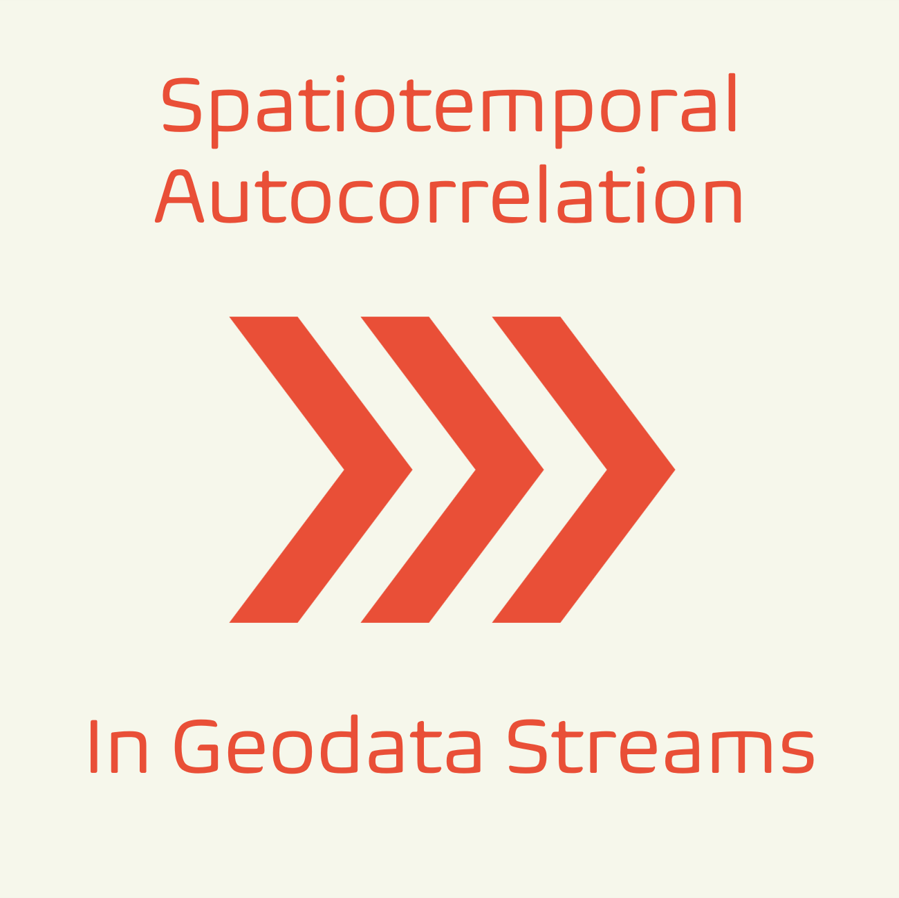

# Spatio-temporal autocorrelation with Apache Flink

Welcome to this repository for high-frequent dynamic autocorrelation calculated inside geodata streams with Apache Flink.

This is an example how to process data streams for geostatistics in real-time.

An investigation of the capabilities of geoiostatistics in distributed stream processing can be found in my paper:

**"Geostatistics on Real-Time Geodata Streams—An Extended Spatiotemporal Moran’s I Index with Distributed Stream Processing Technologies".**

You can access it here: https://doi.org/10.3390/ijgi12030087